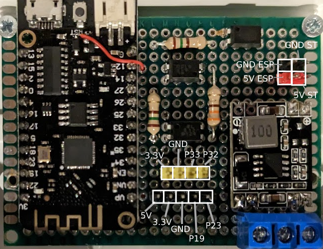

# Micronova Controller

This repo contains documentation and code to interface with a pellet stove based on Micronova controllers.
I only tested it with my own stove (*L'Asolana Marina*), but it should work with all Micronova based stoves. Please note that the `RAM` and `EEPROM` mappings will probably be different for other models.

The code is designed to run on a ESP32 and provides a simple TCP socket based protocol to communicate with the stove. There is a python module in `./python` to interface with the TCP server in a easy way. The ESP also has a simple, interactive serial shell to communicate with the stove.

This is work in progress. MR's for more features (for example: MQTT, HTTP-API) are welcome!


## Stove

### Protocol

The stove has a half duplex serial port, meaning you can either send or recive. It only responds to commands and never sends something by its own. It seems that the protocol is called `Rwms`.
The serial connection needs the following settings:
`1200 baud, 8 data bits, 2 stop bits, no parity, no flow control`.

There are two accessible memories, `RAM` and `EEPROM`. `RAM` is volatile (but backed up by a battery) and can be rewrote many times safely. `EEPROM` is the memory used for storing permanent settings and should not be rewrote many times as writing cycles are limited (commonly 10-100k depending on the memory technology).


#### Reading:

Reading is sending two bytes in the following format:
```
[LOCATION] [ADDRESS]
```

Where `LOCATION` is one of:

* `0x00` RAM
* `0x20` EEPROM

The stove answers with 2 bytes, with the following

```
[PARAM+CHECKSUM] [DATA]
```

It can be decoded with the following pseudo-code:
```
data = stove_rx_data[1];
checksum = stove_rx_data[0];
location = checksum - data;
```
#### Writing

Writing is sending two bytes in the following format:

```
[LOCATION] [ADDRESS] [DATA] [CHECKSUM]
```
Where `LOCATION` is one of:

* `0x80` RAM
* `0xA0` EEPROM

The checksum can be calculated as follows:

```
checksum = LOCATION + ADDRESS + DATA

if ( checksum >= 256 ){
  checksum = checksum - 256;
}
```

The stove answers with 2 bytes:
```
[CHEKSUM] [DATA]
```


#### Known locations

Those are only tested for my stove (*L'Asolana Marina*), it seems like there are different values on different stoves. My Stove has a `L023_7` control board.


| Type | Address | Description |
|------|------|-------------|
| RAM | 0x00 | internal timer of the program (ranging from 0-255 continuously) | 
| RAM | 0x01 | ambient temperature multiplied by 2 | 
| RAM | 0x21 | power state (0-stove off, 1-stove start) | 
| RAM | 0x19 | power setting (0-4, only read works) | 
| RAM | 0x0a | hot air outgoing fan power, seems to be between 0-~50 | 
| RAM | 0x3E | Fumes temperature | 
| RAM | 0x02 | temp, could be air outlet |
| RAM | 0x37 | fumes fan speed |
| RAM | 0x0D | pellet loading formula in use  | 
| RAM | 0x7B | Secounds, decimal, read only |
| RAM | 0x7B | Day of week, decimal, read only |
| RAM | 0x7C | Hour, decimal, read only |
| RAM | 0x7D | Minute, decimal, read only |
| RAM | 0x7E | Day of Month, decimal, read only |
| RAM | 0x7F | Month, decimal, read only |
| RAM | 0x80 | Year since 2000, decimal, read only |
| RAM | 0x58 | Infrared command, 0x54 P+, 0x50 P-, 0x52 T+, 0x58 T-, 0x5a PWR |
| EEPROM | 0x7d | set temperature as 1:1 value | 
| EEPROM | 0x7f | power, 1-4 | 
| EEPROM | 0x25 | night mode, 0=off, 1=on |
| EEPROM | 0xf8 | Day of week (1=monday, 7=sunday) |
| EEPROM | 0xF9 | Hour (0x20 = 20:) |
| EEPROM | 0xFA | Minute (0x30 :30) |
| EEPROM | 0xFB | Day (0x03 3.xx.xx) |
| EEPROM | 0xFC | Month (0x12 = x.12.xx) |
| EEPROM | 0xFD | Year (0x22 = 2022) |
| EEPROM | 0x50 | daily timer enable 0x00=off, 0x01=on |
| EEPROM | 0x51 | daily timer 01, turn on time (x10 minutes since midnight) |
| EEPROM | 0x52 | daily timer 01, turn off time (x10 minutes since midnight) |
| EEPROM | 0x53 | daily timer 01, power, 1-4 |
| EEPROM | 0x54 | daily timer 01, set temperature |
| EEPROM | 0x56 | daily timer 02, turn on time (x10 minutes since midnight) |
| EEPROM | 0x57 | daily timer 02, turn off time (x10 minutes since midnight) |
| EEPROM | 0x58 | daily timer 02, power, 1-4 |
| EEPROM | 0x59 | daily timer 02, set temperature |


State (`0x21`) has the following values for my stove:

| State | Description |
|-------|-------------|
| 0x00  | Turned off, send to force off |
| 0x01  | Starting/checking, send to turn on |
| 0x02  | Turning on phase 1, dont send this|
| 0x03  | Turning on phase 2, dont send this |
| 0x04  | Stove running, dont send this |
| 0x05  | ?, dont send this |
| 0x06  | Stopping, send to turn off |
| 0x07  | Cooling down running, not sure if sending is safe |


Turning the stove on works fine over writing `0x01` to `RAM 0x21`, turning it off (sending `0x06` to `RAM 0x21`) seems to be problematic. My stove enters "turning off mode" but takes pretty long to do so (~50min), so this is not the procedure used by programs or the power button which takes around 10min. Searching around in the internet told me that i am not the only one which has this issue. The stove also has a infrared control, which seem to write commands to `RAM 0x58`. So sending 10 times `0x5a` to `RAM 0x58` with a delay of `100ms` turns the stove off safley.

Sending various IR commands can be done by writing to `RAM 0x58` with a delay of `100ms`. To set power and temp, send it at least twice, for the power button (longpress) at least 10 times.

| State | Description   |
|-------|---------------|
| 0x54  | Power +       |
| 0x50  | Power -,      |
| 0x52  | Temperature + |
| 0x58  | Temperature - |
| 0x5a  | Power ON/OFF  |


Room temperature can be read in `0x01`, then divide the value by 2. The display of the stove cannot display decimal places but it seems that the sensor has an accuracy of 0.5°C. 

The power (P1-P4) can be changed when writing to `EEPROM 0x7f` value `0x01 (P1) to 0x04 (P4)`, then the stove immediatley changes.
Manually changing over the display seems to change it also in `RAM 0x19`, so i would recommend to write it there as well. Another possibility is to set the power over IR commands (see above) which possibly is safer.


The fan speed can be calculated as follows:
Take the maximum value of the spins and divide it by 255, the result is offset.
```
Rpm=(value*10)+offset
```

The clock in RAM can only be read. To set it, it has to be written to the EEPROM addresses above. The coding seems to be BCD, or base 16 ints, meaning hex 0x16 is value 16, 0x53 means 53 and so on. In Python, a number can be converted as follows:

```python
number_to_convert=20
int(str(number_to_convert),16)
```

Please see [doc/stove-locations.md](./doc/stove-locations.md) for more possible locations.


#### Using the Arduino library

There is a Arduino library in `src/micronova_stove.hpp` which makes interfacing with the stove more easy, it takes care of checksums and serial settings.

It can be used like this:

```cpp
#include "micronova_stove.h"

// create the stove object
MicronovaStove stove( stove_pin_rx, stove_pin_tx, stove_pin_rx_enable );

void setup(){
  // init the stove
  stove.init();
}


void loop(){

  // read RAM 0x21 and print result
  stove.read_ram(0x21);
  Serial.println(stove.last_read_value)

  // read EEPROM 0x25 and print result
  stove.read_eeprom(0x25);
  Serial.println(stove.last_read_value)

  // write 0x01 to location 0x21 in RAM
  stove.write_ram(0x21,0x01);

  // write 0x01 to location 0x25 in EEPROM
  stove.write_eeprom(0x21,0x01);

  // turn the stove on
  stove.on();

  // turn it off
  stove.off();

}
```

### Software

#### ESP Configuration


```
# open up a serial console to the device, this will give you a interactive shell
make monitor

# read stove state to see if everything works 
read-ram 0x21

# configure wifi ssid & pass
wificonfig ssid-name ssid-password

# configure static IP (ip, gateway, netmask, dns-server)
ifconfig static 10.10.3.60 10.10.1.1 255.255.0.0 10.10.1.1

# configure dhcp
ifconfig dhcp

# set port for the tcp server 
set-tcp-port 9040

# restart to take effect of the settings
restart

# check internet connection
ifconfig
```

#### Python module

```python
from python.micronova_client import MicronovaClient

stove = MicronovaClient("10.10.3.60",9040)
stove.connect()

print(stove.stove.get_ambient_temp())
print(stove.stove.get_stove_state())

res = stove.read_ram(0x21)
print(res)

stove.on()
stove.off()

stove.close()
```


### Interface Circuit

The circuit uses optocouplers to do the level-shifting (stove is 5V logic and ESP32 3.3V).
The opocouplers also implementing a echo cancellation.
For reading values from the stove, one has to pull the `ENABLE_RX` optocoupler to low, but then no data at `TX` will be sent to the stove anymore.

The circuit is based on the one from [philibertc/micronova_controller](https://github.com/philibertc/micronova_controller)

#### BOM

* 2x Resistor 150R
* 1x Resistor 330R
* 3x Optocoupler PC817 or EL817
* 1x Step Down Module (20V input, 5v output)

#### Circuit


#### Connector on stove


#### Pinout Board

(This is my personal board, you have to build one on your own)




## Links that helped me

- https://k3a.me/ir-controller-for-pellet-stove-with-micronova-controller-stufe-e-pellet-aria-ir-telecomando/
- https://ridiculouslab.altervista.org/en/micronova-protocol-converter/
- https://stufapellet.forumcommunity.net/?t=57458738
- https://github.com/philibertc/micronova_controller