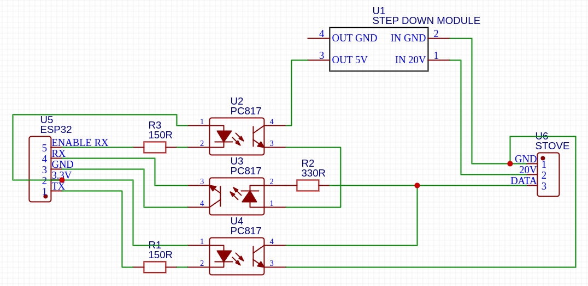
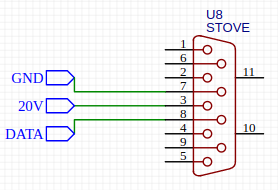

# Micronova Controller

## Stove


### Protocol

The stove has a half duplex serial port, meaning you can either send or recive. It only responds to commands and never sends something by its own. It seems that the protocol is called `Rwms`.
The serial connection needs the followin settings:
`1200 baud, 8 data bits, 2 stop bits, no parity, no flow control`.

There are two accessible memories, `RAM` and `EEPROM`. `RAM` is volatile (but backed up by a battery) and can be rewrote many times safely. `EEPROM` is the memory used for storing permanent settings and should not be rewrote many times as writing cycles are limited (commonly 10-100k depending on the memory technology).


#### Reading:

Reading is sending two bytes in the following format:
```
[LOCATION] [ADDRESS]
```

Where `LOCATION` is one of:

* `0x00` RAM
* `0x20` EEPROM

The stove answers with 2 bytes, with the following

```
[PARAM+CHECKSUM] [DATA]
```

It can be decoded with the following pseudo-code:
```
data = stove_rx_data[1];
checksum = stove_rx_data[0];
location = checksum - data;
```
#### Writing

Writing is sending two bytes in the following format:

```
[LOCATION] [ADDRESS] [DATA] [CHECKSUM]
```
Where `LOCATION` is one of:

* `0x80` RAM
* `0xA0` EEPROM

The checksum can be calculated as follows:

```
checksum = LOCATION + ADDRESS + DATA

if ( checksum >= 256 ){
  checksum = checksum - 256;
}
```

#### Known locations

Those are only tested for my stove (*L'Asolana Marina*), it seems like there are different values on different stoves.


| Type | Address | Description |
|------|------|-------------|
| RAM | 0x00 | internal timer of the program (ranging from 0-255 continuously) | 
| RAM | 0x01 | ambient temperature multiplied by 2 | 
| RAM | 0x21 | power state (0-stove off, 1-stove start) | 
| RAM | 0x19 | power setting (0-4, only read works) | 
| RAM | 0x3E | Fumes temperature | 
| RAM | 0x02 | temp something, increasing |
| RAM | 0x37 | fumes fan speed |
| RAM | 0x0D | pellet loading formula in use  | 
| RAM | 0x7D | temp, increasing, intake?, gets cold quicker than 0x02 | 
| EEPROM | 0x7d | set temperature as 1:1 value | 
| EEPROM | 0x7f | power, 1-4 | 
| EEPROM | 0x25 | night mode, 0=off, 1=on |


State (`0x21`) has the following values for my stove:

| State | Description |
|-------|-------------|
| 0x00  | Turned off, send to force off |
| 0x01  | Starting/checking, send to turn on |
| 0x02  | Turning on phase 1, dont send this|
| 0x03  | Turning on phase 2, dont send this |
| 0x04  | Stove running, dont send this |
| 0x05  | ?, dont send this |
| 0x06  | Stopping, send to turn off |
| 0x07  | Cooling down running, not sure if sending is safe |

Room temperature can be read in `0x01`, then divide the value by 2. The display of the stove cannot display decimal places but it seems that the sensor has an accuracy of 0.5°C. 

The power (P1-P4) can be changed when writing to `EEPROM 0x7f` value `0x01 (P1) to 0x04 (P4)`, then the stove immediatley changes.
Manually changing over the display seems to change it also in `RAM 0x19`, so i would recommend to write it there as well.


The fan speed can be calculated as follows:
Take the maximum value of the spins and divide it by 255, the result is offset.
```
Rpm=(value*10)+offset
```


Please see [doc/stove-locations.md](./doc/stove-locations.md) for more possible locations.


#### Using the Arduino library

There is a Arduino library in `src/micronova_stove.hpp` which makes interfacing with the stove more easy, it takes care of checksums and serial settings.

It can be used like this:

```cpp
#include "micronova_stove.hpp"

// create the stove object
MicronovaStove stove( stove_pin_rx, stove_pin_tx, stove_pin_rx_enable );

void setup(){
  // init the stove
  stove.init();
}


void loop(){

  // read RAM 0x21 and print result
  stove.read_ram(0x21);
  Serial.println(stove.last_read_value)

  // read EEPROM 0x25 and print result
  stove.read_eeprom(0x25);
  Serial.println(stove.last_read_value)

  // write 0x01 to location 0x21 in RAM
  stove.write_ram(0x21,0x01);

  // write 0x01 to location 0x25 in EEPROM
  stove.write_eeprom(0x21,0x01);

}

```

### Interface Circuit

#### BOM

* 2x Resistor 150R
* 1x Resistor 330R
* 3x Optocoupler PC817 or EL817
* 1x Step Down Module (20V input, 5v output)

#### Circuit



#### Connector on stove




## Links that helped me

- https://k3a.me/ir-controller-for-pellet-stove-with-micronova-controller-stufe-e-pellet-aria-ir-telecomando/
- https://ridiculouslab.altervista.org/en/micronova-protocol-converter/
- https://stufapellet.forumcommunity.net/?t=57458738
- https://github.com/philibertc/micronova_controller